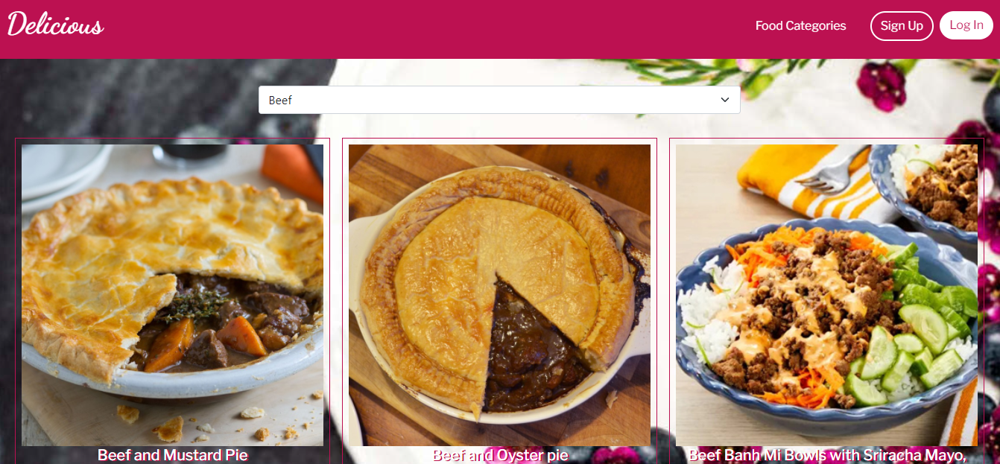
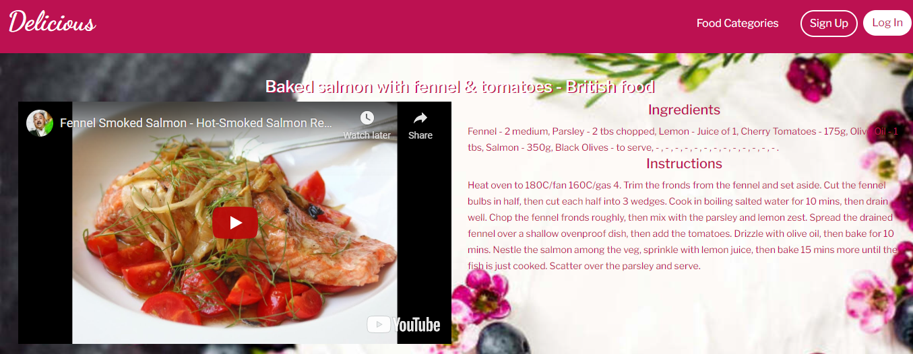
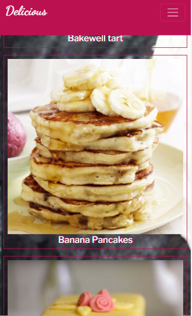
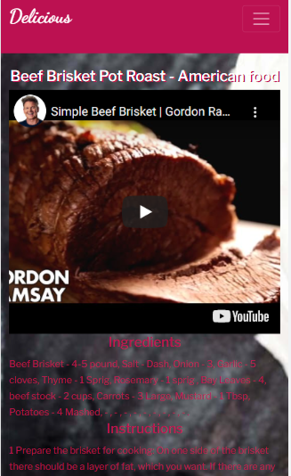

 
# Food Catalogue

Food Catalogue is the best place to find recipes for your meal, there you can get all information about ingredients and instructions with video tutorial. To build this great app we have used  and Redux store as well as the tools lited below.



<table>
<tr>
 <td>
  
</td>
<td>
  
</td>
</tr>
</table>

### Built With


 


## Getting Started

#### To get local copy up and running follow these simple example steps

1. On the project GitHub page, navigate to the main page of the repository.
2. Under the repository name, locate and click on a green button named `Code`. 
3. Copy the project URL as displayed.
4. If you're running the Windows Operating System, open your command prompt. On Linux, Open your terminal. 
5. Change the current working directory to the location where you want the cloned directory to be made. Leave as it is if the current location is where you want the project to be. 
6. Type git clone, and then paste the URL you copied in Step 3. <br>
For this project:

```
git clone https://github.com/AbdumurodovaZulfizar/React-Redux-Catalogue.git
```
7. Press Enter. Your local copy will be created.

## Prerequisites

- Node
- Webpack

## Setup
- run :

```
npm install
``` 

to install all required node modules

- To see local version run:

```
npm start
```

To run tests: 
```
npm run test
```

### Live Version

[Food Catalogue](https://cocky-cray-06edc3.netlify.app/)

## Authors

🏻‍💼 **Zulfizar Abdumurodova**

- GitHub: [Abdumurodova Zulfizar](https://github.com/AbdumurodovaZulfizar) 
- Twitter: [Abdumurodova Zulfizar](https://twitter.com/Zulfiza70357085)
- LinkedIn: [Abdumurodova Zulfizar](https://www.linkedin.com/in/zulfizar-abdumurodova-a61527206/) 


## 🤝 Contributing

Contributions, issues, and feature requests are welcome!
Feel free to check the [issues page](../../issues).

1. Fork the Project
2. Create your Feature Branch (`git checkout -b feature/AmazingFeature`)
3. Commit your Changes (`git commit -m 'Add some AmazingFeature'`)
4. Push to the Branch (`git push origin feature/AmazingFeature`)
5. Open a Pull Request

## Show your support

Give a ⭐️ if you like this project!

## Acknowledgments

- [Microverse](https://www.microverse.org/) for international opportunities.
- Special thanks to all code reviewers.
- FrontEndMasters and FreeCodeCamp for their open source
- You can be software developer only if you want and try for it 😊

## 📝 License

Copyright 2021 Zulfizar Abdumurodova
- [MIT LICENSE](https://github.com/AbdumurodovaZulfizar/React-Redux-Catalogue/blob/create_app/LICENSE) for this project.
